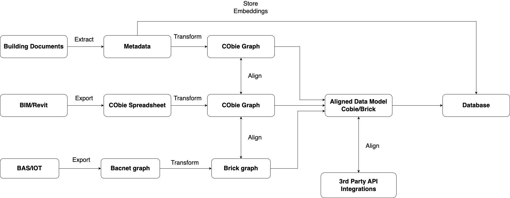

<div>
<a href="https://syyclops.com"><p align="center">

</a>

<h3 align="center">
  <strong>Open Operator</strong>
</h3>
</div>

## What is Open Operator?

Open Operator is an open source AI Assitant that specialized in building operations and maintenance. It has access to all the tools it needs to help facility owners, managers, and operators run their buildings more efficetly.


## Problem

Today in building operations information sits in different data siloes which makes it hard to access information or get a good idea about how the building is operating quickly. For example, asset information is stuck inside hard copy building documents that managers need to manually search through, while work orders are in a CMMS system, and building performance data is inside a BAS.

A lot of the work for this project involves extracting information from these different data siloes and aligning the systems.

## ETL Pipeline

In order to have an AI Assistant that has access to the tools it needs, there is a lot of work that needs to be done to make those tools available.

Extract information from the different data sources, transform it into a clean data model based on open standards.



## What is COBie and Brick?

**[COBie](https://www.thenbs.com/knowledge/what-is-cobie)**:

Construction Operations Building Information Exchange (COBie) is a standard format for delivering asset information as a part of the handover process from consutrction to operations.

**[Brick](https://brickschema.org/)**:

Brick is a standard data model for Building Automation Systems. This standard has been created because every building calls their devices and sensors different names which makes it difficult to create smart building applications.

## Get Started

A step-by-step series of examples that tell you how to get a development environment running:

```
# Clone the repository
$ git clone https://github.com/syyclops/open-operator.git

# Navigate to the repository directory
$ cd open-operator

# Create and activate python virtual environment
$ python3 -m venv venv
$ source ./venv/bin/activate

# Install dependencies
$ pip install -r requirements.txt
```

## License

This project is licensed under the MIT License - see the [License](./LICENSE) file for details.
